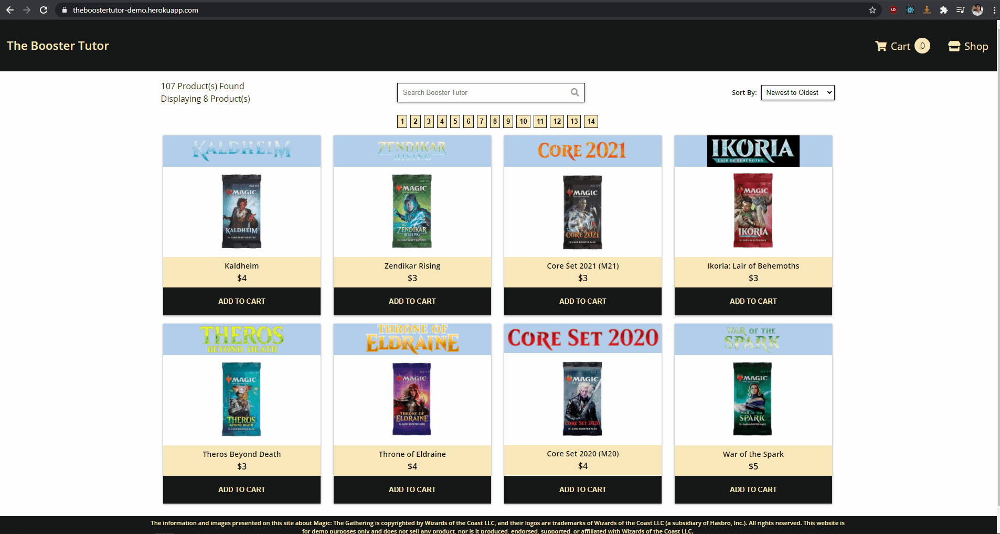

# The Booster Tutor
### [Live Demo](https://theboostertutor-demo.herokuapp.com/ "Live Demo of The Booster Tutor")

## Summary:
This is a pet-project e-commerce site focused around the sale of Magic: The Gathering booster packs. Written with React / Redux frontend, Node, Express, and MongoDB backend from scratch.

## Key features:

### Products
Simple, nonrelational database to fetch all products with a single axios api call. Allows the redux state shape to stay flat and reuseable in the frontend, and additional features can be easily added in the future without dropping the database.

### Cart

Products can be added to carts, whose state is tracked in the reducer and stored in localStorage. This results in no repeated data being stored in the backend, and only one centralized operation. Additional benefits to this should additional beneits such as user auth be implemented, is that this allows cart access to anonymous users, while being fetchable when they register/log in.

### Front-end

Dynamic rendering of search filter, sort by, and paginated products using custom React hooks, and full mobile-responsivity with hamburger menu dropdown and backdrop.  

